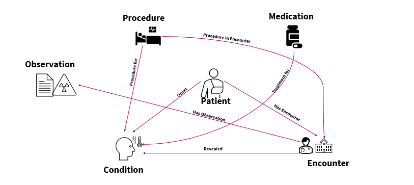
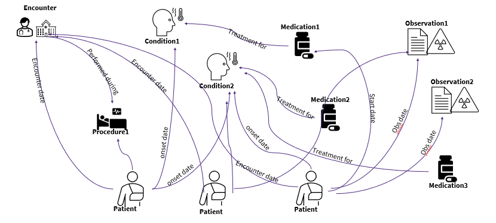
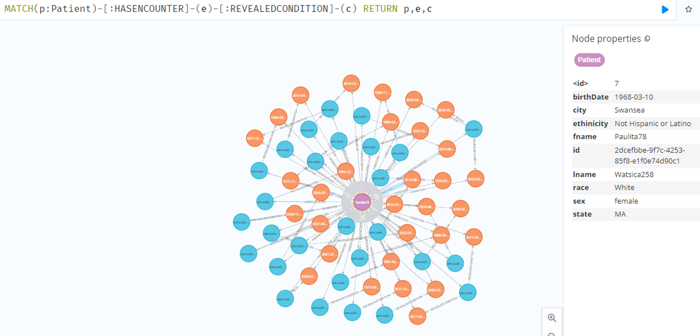

# grapfhir
This is an attempt to load FHIR R4 json files into a graph data model for running graph analytics to build applications for chronic care management, Population health etc.

Current data loading is simple per patient.
Here we link patient with conditions, encounters, medications, procedures, observations.

but my aim is to build cross patient grapth with temporal,status labeled relationship with conditions, medications, procedures, encounters and observations.

## System Requirements
<li>Memory : 8G+
<li>Java 11+
<li>docker

## Create directories in local file system for
<li>log : Neo4j database logs
<li>plugins : Neo4j add ons like APOC, gds jars are to be copied here
<li>imports : FHIR data to be loaded as graph is stored here

## Downlaod plugin jars from neo4j site for following and copy in plugins folder
1. neo4j-graph-data-science-1.8.6.jar
2. apoc-4.2.0.4-all.jar

## Downlaod patient FHIR R4 data for your study and copy to "import" directory

## Start NEO4J container locally using following command
docker run --name testneo4j -p 7474:7474 -p7687:7687 -d  -v $[DATA]:/data -v $[LOG]:/logs -v $[IMPORT]:/var/lib/neo4j/import -v $[PLUGINS]:/plugins --env NEO4J_AUTH=neo4j/******* --env NEO4J_dbms_connector_https_advertised__address="localhost:7473"  --env NEO4J_dbms_security_procedures_unrestricted="apoc.*,cyfhir.*"  --env NEO4J_dbms_connector_http_advertised__address="localhost:7474" --env NEO4J_dbms_connector_bolt_advertised__address="localhost:7687" --env NEO4J_dbms_security_procedures_unrestricted=apoc.*,gds.* --env NEO4J_dbms_memory_heap_max__size=8G --env NEO4J_apoc_import_file_enabled=true neo4j:4.2.19

<li>Note :  Replace values for DATA,LOGS,IMPORT,PLUGINS varibales as per your file system. and password for NEO4J_AUTH

## Visualize patient FHIR in NEO4J browser

## Open a neo4j browser using below
http://localhost:7474/browser/

## Refer cypher-queries.cql file for loading dataset and executing analysis queries. Including GDS queries with cosine similarity
